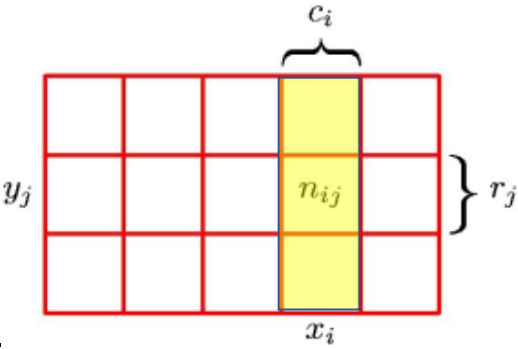

# Teoría de la Probabilidad

## Conceptos Probabilidad

### Incertidumbre

Concepto clave dentro del contexto de reconocimiento de patrones y aprendizaje automático. Se ocasiona porque los datos son finitos y porque existe ruido en las mediciones. La teoría de la Probabilidad y la Teoría de la Decisión proporciona herramientas conceptuales para el manejo de la incertidumbre y permiten obtener predicciones óptimas a partir de un conjunto de datos, incluso si este está incompleto o ambiguo.

#### Ejemplo 1

Se elige al azar primero una caja y luego, de la caja seleccionada se escoge al azar una fruta. Se observa y se retorna a su caja de origen.

- La caja representa una variable aleatoria, que se puede denotar con $C$. esta variable ¿cuáles posibles valores puede tomar? R/: 1 o 2
- El tipo de fruta también sera una variable, que llamaremos $F$. ¿Qué valores puede tomar esta variable? R/: Manzana o naranja.

### Probabilidad

Se puede definir como una fracción de veces que ocurre un evento del total de ensayos que se realicen, cuando el límite de ensayos tiende a infinito.

*Nota:* Las probabilidades siempre están en el intervalo de $[0,1]$. Además si se incluyen todos los eventos, la suma de probabilidades debe ser 1.

Tomando en cuenta el ejemplo 1 de la sección anterior, ¿Cuál es la probabilidad de escoger la caja 1? R/: $P(C=1) = \frac{1}{2}$.

Complete la tabla con las probabilidades respectivas:

|Caja|Manzana|Naranja|
|--|--|--|
|1|$\frac{2}{8} = \frac{1}{4} = 0,25$|$\frac{6}{8} = \frac{3}{4} = 0,75$|
|2|$\frac{3}{4} = 0,75$|$\frac{1}{4} = 0,25$|

En el análisis de probabilidad pueden surgir varias preguntas, tales como:

- ¿Cuál es la probabilidad de escoger una naranja? ***Probabilidad Marginal:*** $P(F=naranja)$
- ¿Cuál es la probabilidad de que esa naranja sea de la caja 1? ***Probabilidad Condicional:*** $P(C=1 | F=naranja)$
- ¿Cuál es la probabilidad de obtener una naranja y la caja 1? ***Probabilidad Conjunta:*** $P(C=1, F=naranja)$

### Regla de la suma

Considere 2 variables aleatorias:

- $X$ puede tomar los valores de: $x_i, i=1, ..., M$
- $Y$ puede tomar los valores de: $y_j, j=1, ..., L$
- $N$ ensayos que muestrean tanto a $X$ como a $Y$
- Número de ensayos con $X=x_i$ y $Y=y_j$ es un $n_{ij}$

*Probabilidad Conjunta* $P(X=x_i, Y=y_j) = \frac{n_{ij}}{N}$

*Probabilidad Marginal* $P(X=x_i) = \frac{c_i}{N}$

Dado que:

$$c_i = \sum_{j}n_{ij}$$

Entonces la probabilidad marginal sera:

$$p(X=x_i) = \sum_{j=1}^{l} p(X=X_i, Y=y_j)$$

### Regla del producto

Considera solo las instancias donde $X=x_i$. La fracción de las instancias donde $Y=y_j$ se puede escribir como $p(Y=y_j | X=x_i)$, la cual se denomina *probabilidad condicional*.

La relación entre la probabilidad condicional y conjunta es:

$$p(Y=y_j, X=x_i) = \frac{n_{ij}}{c_i}$$

$$p(X=x_i, Y=y_j) = \frac{n_{ij}}{N} = \frac{n_{ij}}{c_i} \cdot \frac{c_i}{N} = p(Y=y_j, X=x_i)p(X=x_i)$$

En resumen:

- Regla de la suma:
  $$p(x) = \sum_Y p(X,Y)$$
- Regla del producto:
  $$p(X,Y) = p(Y|X)p(X)$$

### Teorema de Bayes

A partir de la regla del producto, y teniendo en cuenta la propiedad de simetría $p(X,Y) = p(Y,X)$, podemos inferir la siguiente relación:

$$p(Y|X) = \frac{p(X|Y)p(Y)}{p(X)}$$

Usando la regla de la suma, el denominador se puede expresar como:

$$p(X) = \sum_Yp(X|Y)p(Y)$$

#### Ejemplo 2

Se tiene una muestra de 60 datos ($N$):

- ¿Cuántos valores posibles hay para $X$? = 9
- ¿Cuántos valores posibles hay para $Y$? = 2
- ¿Cuántos valores hay en $Y=1$? = 34
- ¿Cuántos valores hay en $Y=2$? = 26
- ¿Cuántos valores hay en $X=1, ..., X=9$?

||$X_1$|$X_2$|$X_3$|$X_4$|$X_5$|$X_6$|$X_7$|$X_8$|$X_9$|Total|
|--|--|--|--|--|--|--|--|--|--|--|
|$Y=2$|0|0|0|1|4|5|8|6|2|26|
|$Y=1$|3|6|8|8|5|3|1|0|0|34|
|Totales|3|6|8|9|9|8|9|6|2|60|

***Importante***: Tener en cuenta que

$$p(A|B) \neq p(B|A)$$

$$p(A|B) = \frac{P(A \cap B)}{P(B)}$$

## Ejercicios

### Ejercicio 1

En una asamblea de propietarios de un conjunto residencial se llevó a cabo una votación para aprobar o desaprobar el presupuesto para la reforma de la fachada de la entrada principal. Se obtuvieron los siguientes datos:

|Votos a favor|Votos en contra|Votos nulos|Votos Blanco|
|--|--|--|--|
|40%|25%|15%||

Si se escoge un voto al azar, ¿cuál es la probabilidad que sea en blanco?

R/: La probabilidad de que sea un voto en blanco es de $1 - (0.4+0.25+0.15) = 0.2$.

### Ejercicio 2

En una sala de atención a urgencias médicas se observa que el 30% de los pacientes son menores de edad y de estos, 80% son hombres. Dentro de los que son mayores de edad, el 70% son mujeres. Si se elige un paciente al azar, ¿cuál es la probabilidad que sea hombre y que no sea menor de edad?

||Menor de edad|Mayor de edad|Total|
|--|--|--|--|
|Mujer|$(0.2*0.3 = 0.06$|$(0.7*0.7) = 0.49$|$0.55$|
|Hombre|$(0.8*0.3) = 0.24$|$(0.3*0.7) = 0.21$|$0.45$|
|Total|$0.3$|$0.7$|$1$|

R/: Esto es una probabilidad conjunta. $P(hombre,>edad) = 0.21$.

### Ejercicio 3

Cuatro estudiantes del colegio "Nuevo Horizonte" participaron en un concurso de oratoria. Sus nombres son Anna, José, Leonardo, Paula. Se sabe que la probabilidad de que gane Anna es el doble de la José, la de José es la mitad de la de Leonardo y la probabilidad de que gane Paula es el triple de la de Anna. ¿Cuál es la probabilidad de que Paula no gane?

R/: Asumimos que Anna=A, José=J, Leonardo=L, Paula=P.

$$P(J) = x$$
$$P(A) = 2x$$
$$P(L) = 2x$$
$$P(P) = 6x$$

$$P(A) + P(J) + P(L) + P(P) = 1 $$
$$2x + x + 2x + 6x = 1$$
$$11x = 1$$
$$x = \frac{1}{11}$$

$$P(P) = 6x = 6*\frac{1}{11} = \frac{6}{11}$$
$$1-\frac{6}{11} = \frac{5}{11} = 0.45$$

La probabilidad de que no gane Paula es de 0.45

### Ejercicio 4

Suponga que tiene tres cajas de colores roja (r), azul (a) y verde (v). La caja roja contiene 3 manzanas, 4 naranjas y 3 limones. La caja azul contiene 1 manzana, 1 naranja y 0 limones. Y la caja verde contiene 3 manzanas, 3 naranjas y 4 limones. Si una caja es escogida aleatoriamente con probabilidades $p(r)=0.2$, $p(a)=0.2$ y $p(v)=0.6$, y una fruta es removida de la caja (con igual probabilidad de seleccionar cualquier item de la caja) entonces:

1. ¿Cuál es la probabilidad de seleccionar una manzana?
2. Si se observa que la fruta seleccionada es una naranja, ¿qué probabilidad hay que venga de la caja verde?

|Caja|Manzana|Naranja|Limón|Total|
|--|--|--|--|--|
|Roja|3|4|3|10|
|Azul|1|1|0|2|
|Verde|3|3|4|10|
|Totales|7|8|7|22|

Respuestas:

1. La probabilidad de seleccionar una manzana, si todas las cajas tuvieran las mismas probabilidades, entonces $P(Manzana)= \frac{7}{22} = 0.32$, pero tomando en cuenta las probabilidades de las cajas, entonces la probabilidad se tomara de la siguiente manera:

    $$(\frac{2}{10} \cdot \frac{3}{10}) + (\frac{2}{10} \cdot \frac{5}{10}) + (\frac{6}{10} \cdot \frac{3}{10})$$
    $$\frac{6}{100} + \frac{10}{100} + \frac{18}{100} = \frac{34}{100}$$
    $$\frac{34}{100} = \frac{17}{50} = 0.34$$
    $$P(manzana) = \frac{17}{50} \thickapprox 0.34$$

2. Esta es una propiedad condicional $P(verde|naranja)$

    $$P(verde|naranja) = \frac{P(verde \cap naranja)}{P(naranja)}$$
    $$P(verde|naranja) = \frac{\frac{3}{22}}{\frac{8}{22}}$$
    $$P(verde|naranja) = \frac{3}{8} \thickapprox 0.375$$
    La probabilidad de que la naranja sea de una caja verde, es de 0.375.

### Ejercicio 5

En un jardín se tienen solo 2 especies de flores: rojas y amarillas. El 40% de las flores del jardín son rosas y el 60% son tulipanes. De las rosas, el 30% son rojas y el resto son amarillas; mientras que, de los tulipanes, el 40% son rojos y el resto amarillos. Si se selecciona una flor al azar,

1. y resulta que es amarilla, ¿cuál es la probabilidad de que sea una rosa?
2. y resulta que es roja, ¿cuál es la probabilidad de que sea una rosa?

|Planta|Rojo|Amarillo|Total|
|--|--|--|--|
|Rosa|12|28|40|
|Tulipán|24|36|60|
|Totales|36|64|100|

1. $P(rosa|amarilla) =  \frac{\frac{28}{100}}{\frac{64}{100}} = \frac{28}{64} = \frac{7}{16} \thickapprox 0.4375$
2. $P(rosa|roja) = \frac{\frac{12}{100}}{\frac{36}{100}} = \frac{12}{36} \thickapprox 0.33$

### Ejercicio 6

En una fábrica, se elaboraron 1000 bombillas. A partir de la siguiente tabla, calcular:

||Buen Estado|Defectuosas|Total|
|--|--|--|--|
|Luz Blanca|508|92|600|
|Luz Amarilla|315|85|400|
|Total|823|177|1000|

1. La probabilidad de que una bombilla seleccionada al azar, esté defectuosa.
2. La probabilidad de que una bombilla seleccionada al azar sea de luz amarilla.
3. Si un cliente compra una bombilla de luz amarilla, ¿cuál es la probabilidad de que esté defectuosa?
4. Si un cliente compra una bombilla de luz blanca, ¿cuál es la probabilidad de que esté defectuosa?
5. Si un cliente compra una bombilla y se da cuenta de que este defectuosa, ¿cuál es la probabilidad de que sea de luz amarilla?

Respuestas:

1. $P(defectuosa) = \frac{177}{1000} \thickapprox 0.18$
2. $P(amarilla) = \frac{400}{1000} = 0.4$
3. $P(defectuosa|amarilla) = \frac{\frac{85}{1000}}{\frac{400}{1000}} = \frac{85}{400} \thickapprox 0.2125$
4. $P(defectuosa|blanca) = \frac{\frac{92}{1000}}{\frac{600}{1000}} = \frac{92}{600} \thickapprox 0.153$
5. $P(amarilla|defectuosa) = \frac{\frac{85}{1000}}{\frac{177}{1000}} = \frac{85}{177} \thickapprox 0.48$
